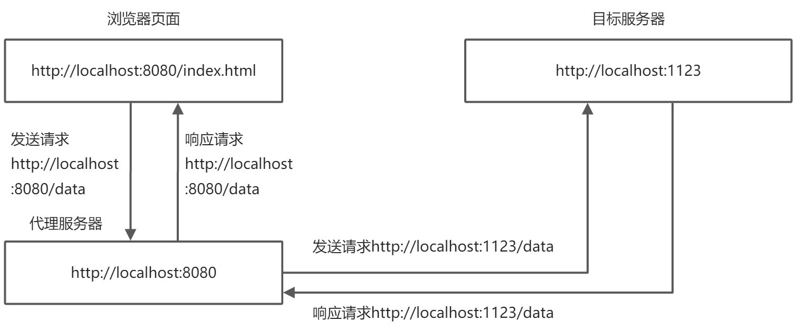

## 什么是同源

如果两个地址具有相同的 **协议、域名、端口号**，我们认为他们具有相同的源

## 什么是浏览器同源策略

同源策略是浏览器的一个安全限制，它阻止了 **不同域** 之间进行数据交互。

### 同源策略阻止了哪些数据交互

1.  服务读取非同源策略下的 `cookie`、`storage`
2.  无法解除非同源的 dom
3.  **无法向非同源地址发送 ajax 请求**

## 什么是跨域

违反同源策略，向不同源发送 ajax 请求的行为称之为跨域。
在正常情况下，**浏览器会阻止跨域行为并且抛出错误**。

## 解决跨域问题

使用一定方案成功向非同源地址发送 ajax 请求

### jsonp 技术解决跨域

jsonp 利用了 `<script>` 标签 **不受同源策略限制** 的特性实现跨域。

#### 实现

需要前后端共同配合完成：
前端 -- 预先定义一个全局的 callback 函数，并将函数名通过 `script`标签发送给后端。

```javascript
window.callback = function (data) {
  // 成功获取数据
}

// 创建script标签发送请求
const scriptEl = document.createElement('script')
scriptEl.src = 'http://localhost:10086/jsonp?callback=callback' // 将回调函数名发送给后端
scriptEl.onload = () => document.body.removeChild(scriptEl)
document.body.appendChild(scriptEl)
```

后端 -- 拿到 callback 函数名，拼接一个函数调用，并将需要返回的数据以参数的形式传入。

```javascript
const http = require('http')

http
  .createServer((req, res) => {
    const url = new URL(req.url, `http://${req.headers.host}`)
    const callback = url.searchParams.get('callback')
    const path = url.pathname
    console.log({ path })
    if (path === '/jsonp') {
      const data = { code: 200, message: 'get data success', data: [1, 2, 3, 4] }
      res.end(`${callback}(${JSON.stringify(data)})`)
      return
    }
    res.end()
  })
  .listen(10086)
```

### cors 跨域

#### 什么是 cors

cors 跨域资源共享策略，是 w3c 的一个标准，运行 XMLHttpRuest 请求向 **非同源** 地址发起请求，完成跨域。

#### 浏览器对请求的处理

浏览器将请求分为了**简单请求和非简单请求**

1.  简单请求 -- 同时满足以下两个条件
    1. 请求方法是以下三种：
       1. HEAD
       2. GET
       3. POST
    2. HTTP 请求头信息不超出以下几种字段
       1. Accept
       2. Accept-Language
       3. Content-Language
       4. Last-Event-ID
       5. Content-Type：只限于三个值 application/x-www-form-urlencoded、multipart/form-data、text/plain
2.  非简单请求 -- 不同时满足以上两种条件

浏览器对两种请求的处理是不一样的

##### 简单请求

为请求头添加 **Origin** 字段，若和响应头中 Access-Control-Allow-Origin 字段一致，则允许访问

##### 非简单请求

在发送非简单请求之前会发送一个 **预请求**，请求方法为 **OPTIONS**。此请求会根据造成非简单请求的原因添加不同的请求头，和响应头对比，看是否允许访问，若不允许则报错

```json
{
  "Access-Control-Request-Method": "PUT", // 由于 请求方法 造成非简单请求则添加
  "Access-Control-Request-Headers": "X-Access-token" // 由于请求头造成
}
```

#### 实现

需要后端设置允许跨域资源共享策略的源，方法，请求头，cookie 等

```javascript
const http = require('http')

http
  .createServer((req, res) => {
    // 允许非简单请求的请求方法为 PUT
    res.setHeader('Access-Control-Allow-Methods', 'PUT')
    // 允许请求的源为 http://localhost:8080
    res.setHeader('Access-Control-Allow-Origin', 'http://localhost:8080')
    // 允许请求时携带的非基本请求头为 aaa、bbb
    res.setHeader('Access-Control-Allow-Headers', 'aaa,bbb')
    // 在预请求成功之后多久不会再发送预请求
    res.setHeader('Access-Control-Max-Age', '1728000')
    // 允许浏览器携带cookie跨域
    res.setHeader('Access-Control-Allow-Credentials', 'true')
    res.end('OK')
  })
  .listen(10086)
```

### 代理服务器实现跨域

#### 原理

只有浏览器向服务器之间发送请求才会有同源策略的限制，**服务器向服务器之间发送请求是没有限制的**。因此，只要向本地服务器发送请求，并由本地服务器转发到目标服务器，即可解决跨域问题。



#### 实现

以 webpack 的 webpack-dev-server 为例
**webpack.config.js**

```javascript
// ...

module.exports = {
  // ...
  devServer: {
    // ...
    port: 8080, // 服务器运行在本地的8080端口
    proxy: {
      // 将本地请求中带 /api/ 的请求代理到 http://localhost:1123
      // 示例：http://localhost:8080/api/test -> http://localhost:1123/api/test
      '/api/': 'http://localhost:1123'
    }
  }
}
```

**index.html**

```html
<!DOCTYPE html>
<html>
  <body>
    <button onclick="senRequest()">Click Me</button>
  </body>
</html>

<script>
  function sendRequest() {
    fetch('/api/test').then(res => console.log(res))
  }
</script>
```
