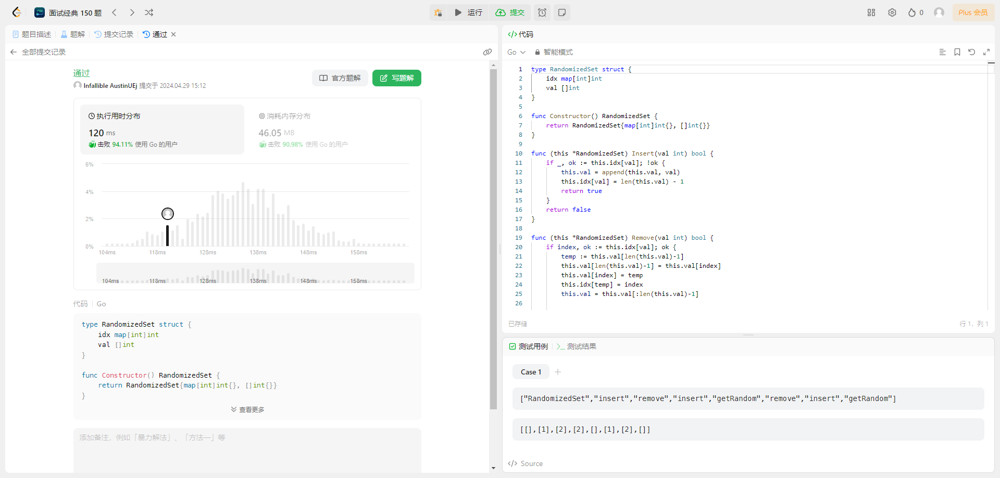

## 题目

实现 `RandomizedSet` 类：

- `RandomizedSet()` 初始化 `RandomizedSet` 对象
- `bool insert(int val)` 当元素 `val` 不存在时，向集合中插入该项，并返回 `true` ；否则，返回 `false` 。
- `bool remove(int val)` 当元素 `val` 存在时，从集合中移除该项，并返回 `true` ；否则，返回 `false` 。
- `int getRandom()` 随机返回现有集合中的一项（测试用例保证调用此方法时集合中至少存在一个元素）。每个元素应该有 相同的概率 被返回。

你必须实现类的所有函数，并满足每个函数的 平均 时间复杂度为 `O(1)` 。

**示例：**

> **输入** > ["RandomizedSet", "insert", "remove", "insert", "getRandom", "remove", "insert", "getRandom"] > [[], [1], [2], [2], [], [1], [2], []]
>
> **输出** > [null, true, false, true, 2, true, false, 2]
>
> **解释**
> RandomizedSet randomizedSet = new RandomizedSet();
> randomizedSet.insert(1); // 向集合中插入 1 。返回 true 表示 1 被成功地插入。
> randomizedSet.remove(2); // 返回 false ，表示集合中不存在 2 。
> randomizedSet.insert(2); // 向集合中插入 2 。返回 true 。集合现在包含 [1,2] 。
> randomizedSet.getRandom(); // getRandom 应随机返回 1 或 2 。
> randomizedSet.remove(1); // 从集合中移除 1 ，返回 true 。集合现在包含 [2] 。
> randomizedSet.insert(2); // 2 已在集合中，所以返回 false 。
> randomizedSet.getRandom(); // 由于 2 是集合中唯一的数字，getRandom 总是返回 2 。

**提示：**

- `-2^31^ <= val <= 2^31^ - 1`
- 最多调用 `insert`、`remove` 和 `getRandom` 函数 `2 * 105` 次
- 在调用 `getRandom` 方法时，数据结构中 _至少存在一个_ 元素。

## 解法

### 1. 哈希表加可变数组

#### 解题思路

:::tip

- 由于题目中涉及到集合中数组的查询，并且查询的时间复杂度需要为 `O(1)`, 此时可以选择采用哈希表，将查询的数字作为哈希表的 key。
- 由于还需要随机获取集合中的数，所有需要额外顶一个数组来保存集合中的数。（如果单纯用哈希表保存，再随机的时候需要循环才能获取到哈希表中的所有数，时间复杂度就不为 `O(1)` 了）
- 在删除数组中的元素时需要根据值查元素的 `index`, 所以哈希表的值应该为这个数在数组中对应的下标
  :::

#### 代码示例

```go
  package main

  import (
  	"math/rand"
  )

  type RandomizedSet struct {
    // 保存数和这个数在数组中下标的map
  	idx map[int]int
    // 包这些数的集合
  	val []int
  }

  // 返回实列
  func Constructor() RandomizedSet {
  	return RandomizedSet{map[int]int{}, []int{}}
  }

  func (this *RandomizedSet) Insert(val int) bool {
    // 查询哈希表中是否存在这个数
  	if _, ok := this.idx[val]; !ok {
        // 不存在则向集合中添加这个数
  		this.val = append(this.val, val)
        // 并记录这个数对应集合的下标
  		this.idx[val] = len(this.val) - 1
  		return true
  	}
  	return false
  }

  func (this *RandomizedSet) Remove(val int) bool {
    // 查询哈希表中是否存在这个数
  	if index, ok := this.idx[val]; ok {
        // 若存在，则交换这个数和最后一个数（避免删除中间元素导致哈希表中记录的索引发生变化）
  		temp := this.val[len(this.val)-1]
  		this.val[len(this.val)-1] = this.val[index]
  		this.val[index] = temp

        // 并修改哈希表中对应索引
  		this.idx[temp] = index

        // 删除集合中的数以及哈希表中的索引
  		this.val = this.val[:len(this.val)-1]
  		delete(this.idx, val)
  		return true
  	}

  	return false
  }

  func (this *RandomizedSet) GetRandom() int {
    // 随机获取一个下标，并返回对应下标的值
  	return this.val[rand.Intn(len(this.val))]
  }
```

#### 测试用例



#### 分析

- 时间复杂度 **O(1)**：因为无论数组的大小如何，获取随机元素的操作都只需要常数时间，所以时间复杂度为**O(1)**

- 空间复杂度 **O(n)**: 因为函数中使用的数据结构包括一个哈希表和一个数组，这两个数据结构的大小都与输入的数据的数量成正比。在最坏的情况下，所有的数据都需要被存储进哈希表和数组中，因此空间复杂度为 **O(n)**。
