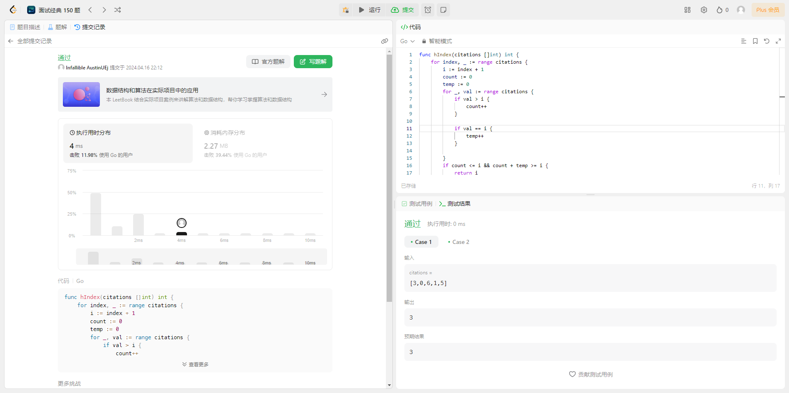
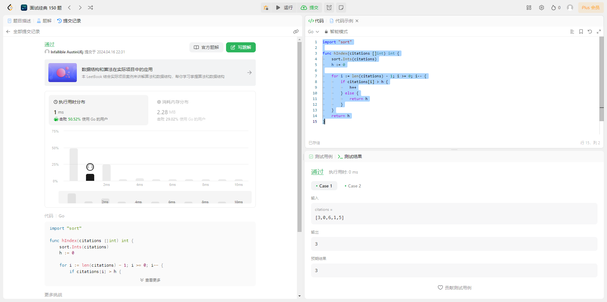

## 题目

给你一个整数数组 `citations` ，其中 `citations[i]` 表示研究者的第 `i` 篇论文被引用的次数。计算并返回该研究者的 `h` 指数。

根据维基百科上 [h 指数的定义](https://baike.baidu.com/item/H%E6%8C%87%E6%95%B0/9951340?fromtitle=h-index&fromid=3991452)：`h` 代表“高引用次数” ，一名科研人员的 `h` **指数** 是指他（她）至少发表了 `h` 篇论文，并且 **至少** 有 `h` 篇论文被引用次数大于等于 `h` 。如果 `h` 有多种可能的值，`h` 指数 是其中最大的那个。

**示例 1：**

> **输入**：citations = [3,0,6,1,5] > **输出**：3
> **解释**：给定数组表示研究者总共有 5 篇论文，每篇论文相应的被引用了 3, 0, 6, 1, 5 次。
> 由于研究者有 3 篇论文每篇 至少 被引用了 3 次，其余两篇论文每篇被引用 不多于 3 次，所以她的 h 指数是 3。

**示例 2：**

> **输入**：citations = [1,3,1] > **输出**：1

**提示**

- `n == citations.length`
- `1<=n<=5000`
- `0<= citations[i] <= 1000`

## 解法

### 1. 暴力枚举

#### 解题思路

:::tip
由于一共有 n 篇文章，所以 h 指数最多是 n，我们可以循环遍历，假设 h 指数为 i，然后内循环去验证 h 指数为 i 是否成立即可。

**例如**
citations = [3,0,6,1,5]
一共五篇文章，循环五次。
第一次假设 h 指数为 1，内循环判断，引用大于 1 的文章有 3 篇。不满足**有 1 篇文章至少引用 1 次，其他文章小于等于 1 次**。
第二次假设 h 指数为 2，内循环判断，引用大于 2 的文章有 3 篇。不满足**有 2 篇文章至少引用 2 次，其他文章小于等于 2 次**。
第二次假设 h 指数为 3，内循环判断，引用大于 3 的文章有 2 篇。引用等于 3 的文章有 1 篇，满足**有 3 篇文章至少引用 3 次，其他文章小于等于 3 次**。
:::

#### 代码示例

```go
  func hIndex(citations []int) int {
	  for index, _ := range citations {
      // 假设指数为i
	  	i := index + 1
      // 记录引用大于指数的文章篇数
	  	count := 0
      // 记录引用等于指数的文章篇数
      temp := 0
      // 内循环记录文章出现次数
	  	for _, val := range citations {
	  		if val > i {
	  			count++
	  		}

        
	  		if val == i {
	  			temp++
	  		}

	  	}
      // 判断是否符合 有i篇文章至少引用了i次  
	  	if count <= i && count + temp >= i {
	  		return i
	  	}
	  }
	  return 0
  }
```

#### 测试用例



#### 分析
- 时间复杂度 **O(n^2^)**： 由于使用了双重循环，所以时间复杂度为 **O(n^2^)**。

- 空间复杂度 **O(1)**: 由于只使用了常数级别的变量，所以空间复杂度为 **O(1)**。


### 2. 排序算法

#### 解题思路

:::tip
由于有h篇文章的引用大于等于h，所以我们尝试将文章根据引用数量排序。再从大到小遍历，并记录文章篇数。当循环到引用数小于文章篇数时，可以确保有h篇文章至少引用h次，其他文章小于等于h次

**例如**
citations = [3,0,6,1,5]
排序完成的数组 [0, 1, 3, 5, 6], 记录文章篇数 h = 0
第一次循环，引用次数为6，大于文章篇数。h++; h == 1
第二次循环，引用次数为5, 大于文章篇数。h++; h == 2
第三次循环，引用次数为3，大于文章篇数。h++; h == 3
第四次循环，引用次数为1，小于文章篇数。此时说明有3篇文章至少引用了3次，其他文章都引用次数都小于三次。满足条件。
:::

#### 代码示例

```go
  import "sort"

  func hIndex(citations []int) int {
  	sort.Ints(citations)
  	h := 0

  	for i := len(citations) - 1; i >= 0; i-- {
  		if citations[i] > h {
  			h++
  		} else {
  			return h
  		}
  	}
  	return h
  }
```

#### 测试用例



#### 分析
- 时间复杂度 **O(n^2^)**： 由于`sort.Ints`排序算法的时间复杂度为*O(n log n)*。循环的时间复杂度为*O(n)*。总时间的时间复杂度为 *O(n log n) + O(n)*。采用大表示法，即为 **O(n^2^)**。

- 空间复杂度 **O(1)**: 由于`sort.Ints`排序算法的空间复杂度为*O(n log n)*, 其他变量为常数级别，为O(1)。 总时间的空间复杂度为 *O(n log n) + O(1)*。采用大表示法，即为**O(n log n)**。


