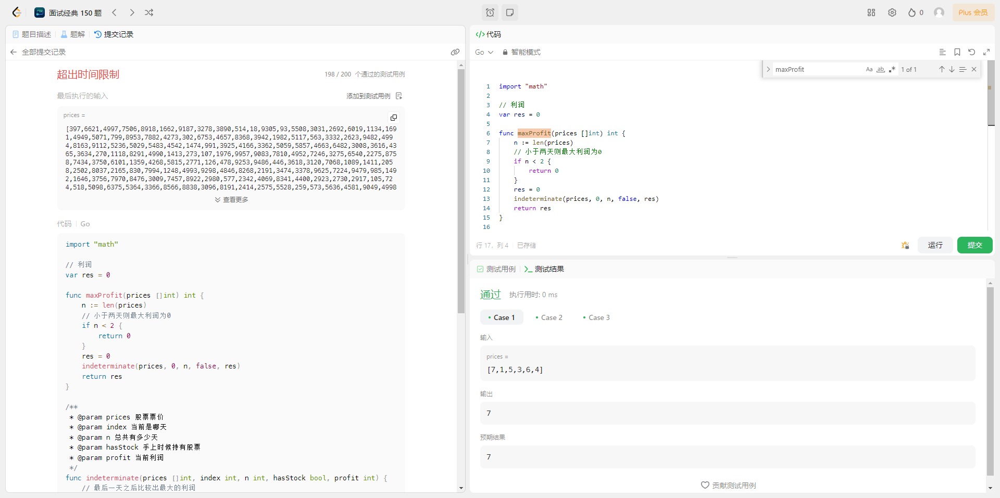
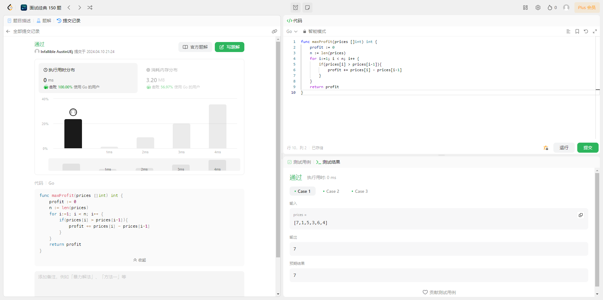

## 题目

给你一个整数数组 prices ，其中 prices[i] 表示某支股票第 i 天的价格。
在每一天，你可以决定是否购买和/或出售股票。你在任何时候 最多 只能持有 一股 股票。你也可以先购买，然后在 同一天 出售。
返回 你能获得的 **最大** 利润 。

## 解法

### 1. 暴力枚举

#### 解题思路

假设手上有股票，则可以卖出股票或不操作。假设手上有股票，可以选择买入或不操作。穷举出所有操作，并记录最后的利润。

#### 代码示例

```go
  import "math"
  // 利润
  var res  = 0

  func maxProfit(prices []int) int {
    n := len(prices)
    // 小于两天则最大利润为0
    if n < 2 {
        return 0
    }
    res = 0
    indeterminate(prices, 0, n, false, res)
    return res
  }

  /**
   * @param prices 股票票价
   * @param index 当前是哪天
   * @param n 总共有多少天
   * @param hasStock 手上时候持有股票
   * @param profit 当前利润
   */
  func indeterminate(prices []int, index int, n int, hasStock bool, profit int) {
    // 最后一天之后比较出最大的利润
    if index == n {
        res = int(math.Max(float64(res), float64(profit)))
        return
    }

    // 不操作
    indeterminate(prices, index+1, n, hasStock, profit)

    if hasStock {
      // 尝试卖出
      indeterminate(prices, index+1, n, false, profit+prices[index])
    } else {
      // 尝试买入
      indeterminate(prices, index+1, n, true, profit-prices[index])
    }
  }
```

#### 测试用例




#### 分析
- 时间复杂度 **O(2^n^)**：由于在此函数中无论是否操作，递归都会继续深入到下一天，所以不操作并不会增加时间复杂度。因此，我们只考虑买入和卖出这两种操作的时间复杂度。它尝试了数组中每个元素的两种可能性（买入和卖出）时间复杂度为 **O(2^n^)**

- 空间复杂度 **O(n)**: 其中n是数组的长度。这是由于递归的深度为n，每一层递归需要O(1)的空间，因此总的空间复杂度为 **O(n)**。

### 2.贪心算法

#### 解题思路
由于当天可以进行卖出和买入，当今天比昨天票价更高，则卖出。此时的利润将会是最高的


#### 代码示例
``` go
  func maxProfit(prices []int) int {
    profit := 0
    n := len(prices)
    for i:=1; i < n; i++ {
        if(prices[i] > prices[i-1]){
            profit += prices[i] - prices[i-1]
        }
    }
    return profit
  }
```

#### 测试用例


#### 分析
- 时间复杂度 **O(n)**: 其中n是数组的长度。这是由于函数需要遍历数组中的每个元素。
- 空间复杂度 **O(1)**：因为该函数只使用了常量级别的额外空间。