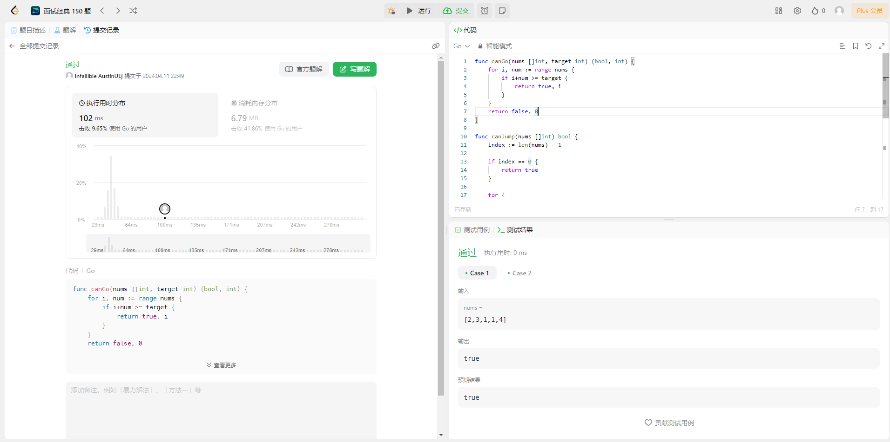
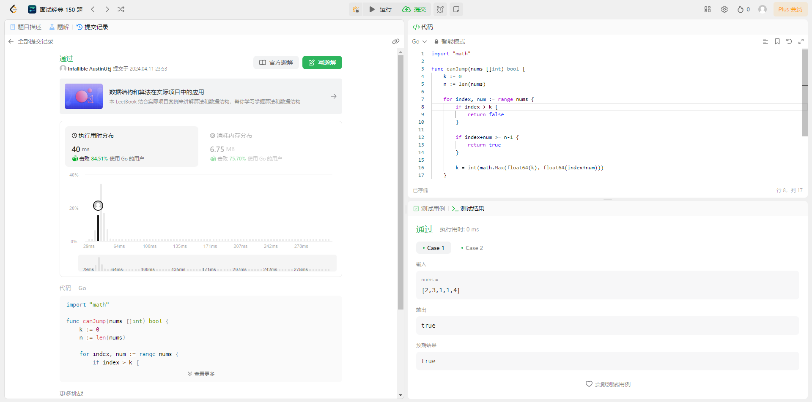

## 题目

给你一个非负整数数组 nums ，你最初位于数组的 **第一个下标** 。数组中的每个元素代表你在该位置**可以跳跃的最大长度**。

判断你是否**能够到达最后一个下标**，如果可以，返回 true ；否则，返回 false 。

**示例 1：**

> 输入：nums = [2,3,1,1,4]
> 输出：true
> 解释：可以先跳 1 步，从下标 0 到达下标 1, 然后再从下标 1 跳 3 步到达最后一个下标。

**示例 2：**

> 输入：nums = [3,2,1,0,4]
> 输出：false
> 解释：无论怎样，总会到达下标为 3 的位置。但该下标的最大跳跃长度是 0 ， 所以永远不可能到达最后一个下标。

**提示：**

- `1 <= nums.length <= 10^4^`
- `0 <= nums[i] <= 10^5^`

## 解法

### 1. 暴力枚举

#### 解题思路

:::tip
可以将问题拆分，分别判断是否有位置可以到达当前位置，如果有位置能到达当前并且这个能到达当前位置的位置为 index 0，则代表可以从第一个位置跳到当前位置

例如:
nums = [2,3,1,1,4]
要判断能否到达最后一位(index == 4),则需要判断 [2,3,1,1] 中是否有元素能跳到 4（index == 4）；
我们发现 2（index == 0）无法跳到 4（index == 4）； 3（index ==1） 可以跳到 4（index == 4）；

那么我们下一步就需要判断 [2] 中是否有元素能跳到 3（index == 1）；
此时 2（index == 0）能跳到 3（index == 1）；并且此时 判断的这个位置为 index == 0；则表示可以从最开始的位置跳到最后位置；
:::

#### 代码示例

```go
  /**
   * 判断是否有位置能跳到指定位置
   * @param nums 待判断的位置
   * @param target 指定位置的index
   * @return { 是否能跳到指定位置，能跳到指定位置的这个位置的indx }
   */
  func canGo(nums []int, target int) (bool, int) {
	  for i, num := range nums {
		  if i+num >= target {
			  return true, i
		  }
	  }
	  return false, 0
  }

  func canJump(nums []int) bool {
  	index := len(nums) - 1

    // 如果只有一个元素，则一定能到最后一个位置
  	if index == 0 {
  		return true
  	}

  	for {
      // 判断是否最后一个位置之前是否有位置能跳跃到最后一个位置
  		ok, idx := canGo(nums[:index], index)
  		if !ok {
  			return false
  		}

      // 如果有并且位置为0 则代表可以从第一个位置跳到最后一个位置
  		if ok && idx == 0 {
  			return true
  		}

      // 如果位置不为0，进入下一轮循环；判断这个位置之前是否有位置可以跳到这个位置
  		index = idx

  	}
  }
```

#### 测试用例



#### 分析

- 时间复杂度 **O(n^2^)**："canJump"函数中主要有一个外层循环和一个内层的"canGo"函数。外层循环的次数最多为数组 nums 的长度，也就是 n。而对于每一次外层循环，"canGo"函数都要遍历一次数组，因此"canGo"函数的时间复杂度也是 O(n)。因此，总的时间复杂度就是 O(n^2^)。

- 空间复杂度 **O(1)**: 因为所有的变量都是常数级别的，因为空间复杂度为 **O(1)**。

### 2.贪心算法

#### 解题思路

:::tip
当前位置的数（nums\[index\]）加上当前位置的索引（index）表示我们可以跳到的最远的位置。我们可以定义一个变量（k）表示当前可以跳到的最远的位置，循环数组，不断的去维护这个最远位置；
如果当前位置（index）大于这个最远的位置，则代表这个位置之前的所有位置都不能跳到当前位置，则返回 false。
如果最远位置(k)大于最后一位（len(nums)）表示可以从最开始位置跳到最后位置。
:::

#### 代码示例

```go
  func canJump(nums []int) bool {
	  k := 0
	  n := len(nums)

	  for index, num := range nums {
	  	if index > k {
	  		return false
	  	}

	  	if index+num >= n-1 {
	  		return true
	  	}

	  	k = int(math.Max(float64(k), float64(index+num)))
	  }
	  return true
  }
```

#### 测试用例



#### 分析

- 时间复杂度 **O(n)**: 因为只遍历了一遍数组，所以时间复杂度为 **O(n)**
- 空间复杂度 **O(1)**：因为该函数只使用了常量级别的额外空间, 所以空间复杂度为 **O(1)**。
