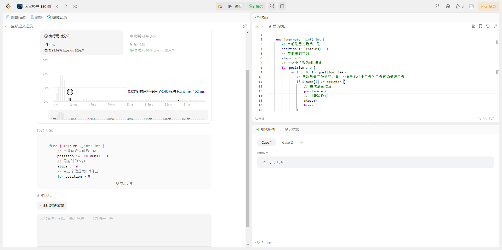
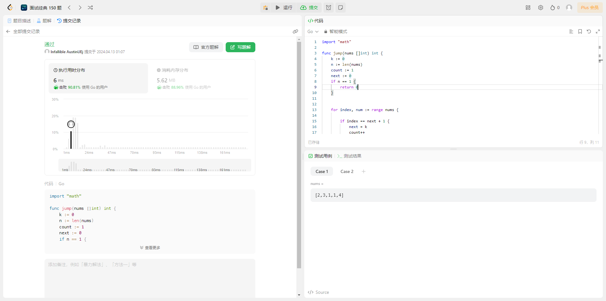

## 题目

给定一个长度为 n 的 **0 索引**整数数组 nums。初始位置为 nums[0]。

每个元素 nums[i] 表示从索引 i 向前跳转的最大长度。换句话说，如果你在 nums[i] 处，你可以跳转到任意 nums[i + j] 处:

- 0 <= j <= nums[i]
- i + j < n

返回到达 nums[n - 1] 的**最小跳跃次数**。生成的测试用例可以到达 nums[n - 1]。

**示例 1：**

> 输入: nums = [2,3,1,1,4]
> 输出: 2
> 解释: 跳到最后一个位置的最小跳跃数是 2。
> 从下标为 0 跳到下标为 1 的位置，跳 1 步，然后跳 3 步到达数组的最后一个位置。

**示例 2：**

> 输入: nums = [2,3,0,1,4]
> 输出: 2

**提示：**

- `1 <= prices.length <= 10^4^`
- `0 <= prices[i] <= 1000`
- 题目保证可以到达 `nums[n-1]`

## 解法

### 1. 暴力枚举

#### 解题思路

:::tip
由于一定能跳跃到最后`nums[n-1]`处。所以我们可以通过判断 **能跳到指定位置的最远位置**,直到这个最远位置为**0**，所用的次数即为最小次数。

例如:
nums = [2,3,1,1,4]
要判断能到达 4(index == 4)的位置为 3（index == 1）、1（index == 3）,其中最远位置为 3（index == 1）。
接着判断能到达 3（index == 3）的位置为 2（index == 0），即使用次数为 2 次。
:::

#### 代码示例

```go
  func jump(nums []int) int {
    // 当前位置为最后一位
    position := len(nums) - 1
    // 需要跳的次数
    steps := 0
    // 当这个位置为0时停止
    for position > 0 {
        for i := 0; i < position; i++ {
            // 从数组最开始循环，第一个能到达这个位置的位置即为最远位置
            if i + nums[i] >= position {
                // 更改最远位置
                position = i
                // 跳跃次数+1
                steps++
                break
            }
        }
    }
    return steps
  }
```

#### 测试用例


#### 分析

- 时间复杂度 **O(n^2^)**：因为使用了双重循环，所以时间复杂度为 **O(n^2^)**

- 空间复杂度 **O(1)**: 因为所有的变量都是常数级别的，因为空间复杂度为 **O(1)**。

### 2.贪心算法

#### 解题思路

:::tip
当前位置能跳到的最远位置为**k = nums[index]+index**, 但随着起跳点的变动，这个 k 也会随之变动；我们定义另外一个变量 `next` 来保存当前这段起跳的终点，当起跳点在 **`(index，next]`** 这个区间时，为下一次跳跃, 即当 **`index == next+1`**时为下一次跳跃。当有一个位置能跳跃到最后位置时结束。
**需要考虑特殊条件，当`len(nums) == 1`时，不用跳跃**

例如:
nums = [2,3,1,1,4,7,7]
第一次起跳 2（index == 0）。最大跳跃位置为 1（index == 2）。
第二次跳跃的起点区间为[3,1]（index为[1,2]），最大跳跃位置为 4 (index == 4)。
第三次跳跃的起点区间为[1,4]（index为[3,4]）,最大跳跃位置 index == 8，超过数组最后一位的下标，即能直接跳跃到终点。
:::

#### 代码示例

```go
  import "math"

  func jump(nums []int) int {
	  k := 0
	  n := len(nums)
	  count := 1
	  next := 0
	  if n == 1 {
		  return 0
	  }


	  for index, num := range nums {
      
      // 当起跳点超过这次起跳段的终点时即视为下一次起跳
      if index == next + 1 {
        // 将下一次的起跳段的终点设置为能跳到的最远距离
			  next = k
			  count++
		  }

      // 当能跳跃到重点时结束
		  if index+num >= n-1 {
			  return count
		  }

      // 实时计算最大位置k
      k = int(math.Max(float64(k), float64(index+num)))
	  } 
	  return count
  }
```

#### 测试用例



#### 分析

- 时间复杂度 **O(n)**: 因为只遍历了一遍数组，所以时间复杂度为 **O(n)**
- 空间复杂度 **O(1)**：因为该函数只使用了常量级别的额外空间, 所以空间复杂度为 **O(1)**。
