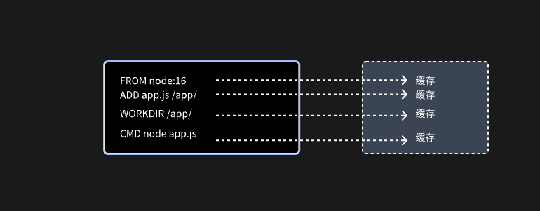
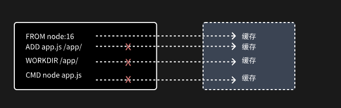

## 什么是 Dockerfile

**Dockerfile**是一个用于描述 Docker 镜像构建过程的文本文件，这个文件可以包含多条构建指令以及相关的描述。用户可以自定义 **Dockerfile**构建自己的 docker 镜像。

## Docker 镜像的构建原理

### Docker 架构模型

Docker 采用的是**C/S**架构。在客户端使用输入构建命令时，Docker 引擎将命令发送到**docker daemon**，docker daemon 就根据请求内容，开始构建工作，并向 Client 持续返回构建过程信息，让用户可以看到当前的构建状态。

### 镜像分层模型

Docker 镜像是用于创建容器的**只读模板**。是由 `Dockerfile` 中定义的指令构建而成。在构建完成时。将会在原有的镜像上生成一个新的镜像层(由很多个 layer 层组成，**Dockerfile**中一行指令即生成一个 layer 层)。


使用 `docker history node-hello-world:latest` 或 `docker inspect node-hello-world:latest` 即可查看`node-hello-world:latest`镜像分层。


其中每一条内容即为**Dockerfile 中每条指令**生成的 layer 层, 配合`docker inspect node-hello-world:latest` 查看生成的 layer 层信息。


### 构建上下文

Client 向 Docker daemon 发送构建命令分为两个部分内容，一部分就是最重要的 **Dockerfile** 文件。另一部分就是构建上下文。

构建上下文是一些文件的集合。这些文件可以是指定路径下的文件，也可以是远程资源中指定路径下的文件。
构建过程中，Docker daemon 可以访问这些文件，并执行相应操作。

构建上下文可以分为以下 3 中情况。

#### 路径上下文

构建命令中指定的具体路径，这个路径下面的所有文件组成的集合即为构建上下文。这些文件将会被打包发送到 Docker daemon 中，然后被解压。

假设一个项目的文件结构如下:

```bash
demo
|-- Dockerfile
|-- src
|-- node_modules
|-- test
```

在 demo 文件夹下执行如下构建命令:

```bash
docker build -t test:v1 .
```

构建请求的第一部分为 Dockerfile，这个文件在当前文件夹下，文件名是默认名称，可以省略。
构建的第二部分内容为构建上下文，在构建命令中 `.` 代表将当前目录作为构建上下文，即 demo 文件夹下所有文件组成的集合成为构建上下文。
Docker 引擎会把不被 **.dockerignore** 中规则匹配的文件都发送到 Docker daemon。并执行 Dockerfile 中的指令。

#### URL 上下文

Docker 还支持利用远程仓库 URL 构建镜像，此时指定远程仓库目录充当构建上下文

```bash
    docker build http://gitee.com:user/my-repo.git#master:docker
```

以上构建命令指定了一个 Gitee 项目的 master 分支，冒号 _:_ 之前是 Git 检出的目标 URL，冒号之后的 docker 是远程仓库根目录下的一个子目录，此时这个名为 docker 的子目录就是构建上下文。

#### 省略上下文

如果 Dockerfile 中的指令不需要对任何文件进行操作，可以省略上下文，此时不会向 Docker daemon 发送额外文件，这可以提高构建速度。

示例构建命令如下

```bash
    docker build -t test:v1 -<< EOF
    FROM scratch
    RUN echo "hello world"
    EOF
```

### 构建缓存

迭代过程中，Dockerfile 对应的资源会经常修改，因此需要频繁重新构建镜像，Docker 为了提高构建速度，设计了多种优化方案，其中最重要的就是构建缓存。

下面会通过一个示例来说明构建缓存是如何工作的，Dockerfile 如下

```bash
    FROM node:16
    ADD app.js /app/app.js
    WORKDIR /app/
    CMD node app.js
```

构建过程中，Dockerfile中指令会从上往下执行，每个构建步骤的结果会被缓存起来，如下图



再次构建会使用缓存中的值。如果文件有修改，那么使用这个文件的上层所有缓存失效。如修改 `app.js`



如果不想使用构建缓存可以使用 `--no-cache` 选项实现。

## 常用构建构建指令
|序号|指令|名功能描述|
|---|---|--------|
| 1 | FROM | 指定基础镜像或父级镜像 |
| 2 | LABEL | 为镜像添加元数据3ENV设置环境变量 |
| 4 | WORKDIR | 指定后续指令的工作目录，类似于 Linux 中的 cd 命令 |
| 5 | USER | 指定当前构建阶段以及容器运行时的默认用户，以及可选的用户组 |
| 6 | VOLUME | 创建具有指定名称的挂载数据卷，用于数据持久化 | 
| 7 | ADD | 将构建上下文中指定目录下的文件复制到镜像文件系统的指定位置 |
| 8 | COPY | 功能和语法与 ADD 类似，但是不会自动解压文件，也不能访问网络资源 |
| 9 | EXPOSE | 约定容器运行时监听的端口，通常用于容器与外界之间的通信 |
| 10 | RUN | 用于在构建镜像过程中执行命令 |
| 11 | CMD | 构建镜像成功后，所创建的容器启动时执行的命令，常与 ENTRYPOINT 结合使用 |
| 12 | ENTRYPOINT | 用于配置容器以可执行的方式运行，常与 CMD 结合使用 |