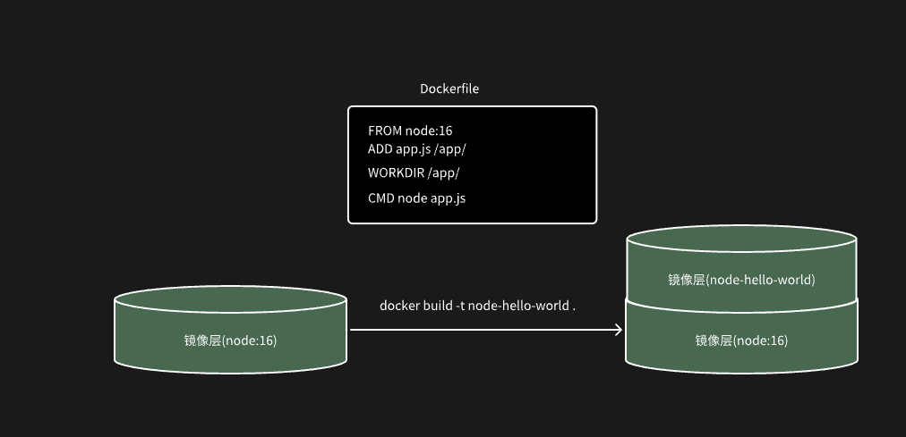
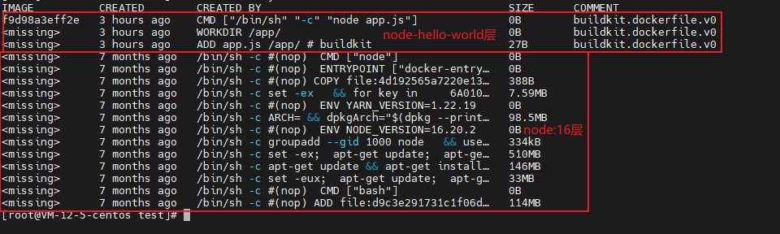
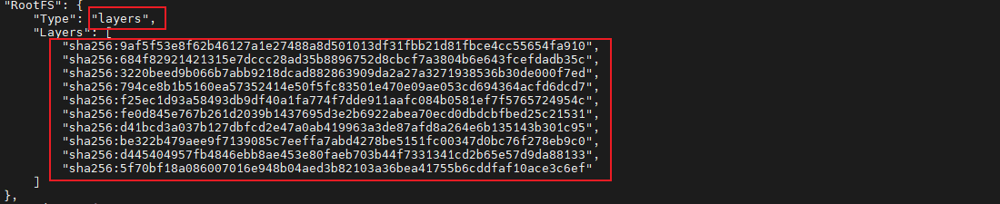

## 什么是 Dockerfile

**Dockerfile**是一个用于描述 Docker 镜像构建过程的文本文件，这个文件可以包含多条构建指令以及相关的描述。用户可以自定义 **Dockerfile**构建自己的 docker 镜像。

## Docker 镜像的构建原理

### Docker 架构模型

Docker 采用的是**C/S**架构。在客户端使用输入构建命令时，Docker 引擎将命令发送到**docker daemon**，docker daemon 就根据请求内容，开始构建工作，并向 Client 持续返回构建过程信息，让用户可以看到当前的构建状态。

### 镜像分层模型

Docker 镜像是用于创建容器的**只读模板**。是由 `Dockerfile` 中定义的指令构建而成。在构建完成时。将会在原有的镜像上生成一个新的镜像层(由很多个 layer 层组成，**Dockerfile**中一行指令即生成一个 layer 层)。

使用 `docker history node-hello-world:latest` 或 `docker inspect node-hello-world:latest` 即可查看`node-hello-world:latest`镜像分层。

其中每一条内容即为**Dockerfile 中每条指令**生成的 layer 层, 配合`docker inspect node-hello-world:latest` 查看生成的 layer 层信息。

111
