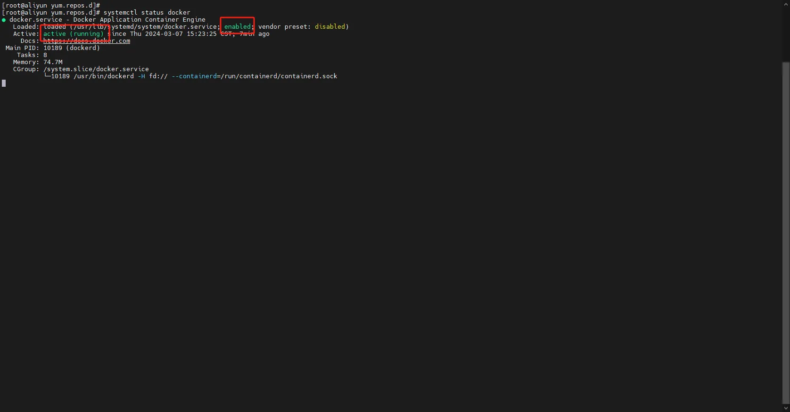

1. 百度搜索阿里开源镜像站

2. 选择容器

3. 选择 `docker-ce(https://developer.aliyun.com/mirror/docker-ce?spm=a2c6h.13651102.0.0.4e771b11EBttZi)`

4. 若是在 centos 上可以直接 使用 `wget https://mirrors.aliyun.com/docker-ce/linux/centos/docker-ce.repo -O /etc/yum.repos.d/docker-ce.repo` 安装阿里的软件源信息

5. 使用 `yum install -y docker-ce`

6. 安装好之后使用 `systemctl enable --now docker` 启动 docker 并设置开机自启

7. 使用 `systemctl status docker` 检查 docker 是否启动

   
