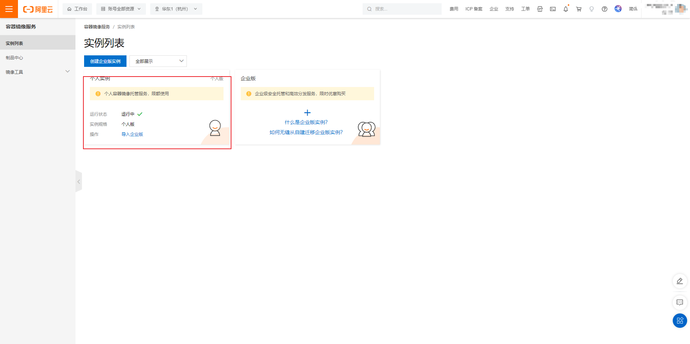

1. 进入[阿里云容器镜像](https://cr.console.aliyun.com/)服务并登录。

2. 选择个人实例（免费）并进入。
   

3. 点击容器镜像仓库并创建。此时你就拥有了自己的容器镜像仓库。

4. 到服务器上 登录阿里云 Docker Registry

   ```bash
   docker login --username=username registry.cn-chengdu.aliyuncs.com

   ```

   用于登录的用户名为阿里云账号全名，密码为开通服务时设置的密码。
   您可以在访问凭证页面修改凭证密码。

5. 从 Registry 中拉取镜像。

   ```bash
     docker pull registry.cn-chengdu.aliyuncs.com/NAMESAPCE/REPOSITORY:[TAG]
   ```

6. 将镜像推送到 Registry。

   ```bash
   docker login --username=username registry.cn-chengdu.aliyuncs.com
   docker tag [ImageId] registry.cn-chengdu.aliyuncs.com/NAMESPACE/REPOSITORY:[TAG]
   docker push registry.cn-chengdu.aliyuncs.com/docker_std1/nginx:[镜像版本号]
   ```

   请根据实际镜像信息替换示例中 NAMESPACE 的[ImageId]和[TAG]参数。

7. 选择合适的镜像仓库地址。
   从 ECS 推送镜像时，可以选择使用镜像仓库内网地址。推送速度将得到提升并且将不会损耗您的公网流量。
   如果您使用的机器位于 VPC 网络，请使用 `registry-vpc.cn-chengdu.aliyuncs.com` 作为 Registry 的域名登录。
8. 示例
   使用`docker tag`命令重命名镜像，并将它通过专有网络地址推送至 Registry。

   ```bash
    docker images
    REPOSITORY TAG IMAGE ID CREATED VIRTUAL
    SIZEregistry.aliyuncs.com/acs/agent 0.7-dfb6816 37bb9c63c8b2 7 days ago 37.89 MB
    docker tag 37bb9c63c8b2 registry-vpc.cn-chengdu.aliyuncs.com/acs/agent:0.7-dfb6816
   ```

   使用 `docker push` 命令将该镜像推送至远程。

   ```bash
   docker push registry-vpc.cn-chengdu.aliyuncs.com/acs/agent:0.7-dfb6816
   ```
