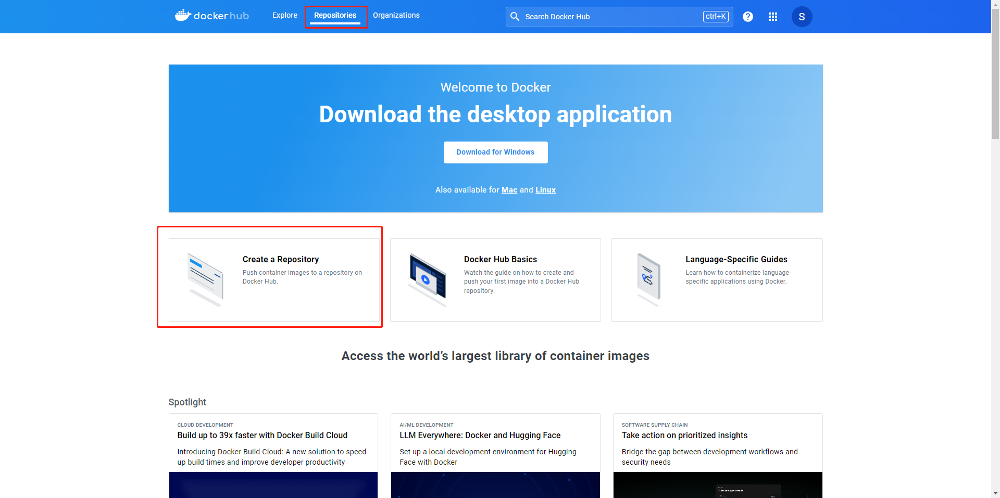
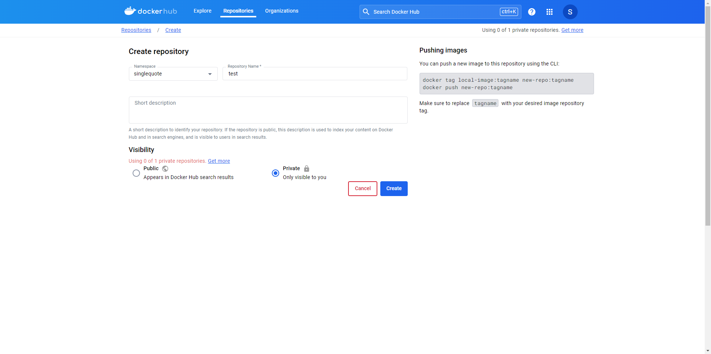
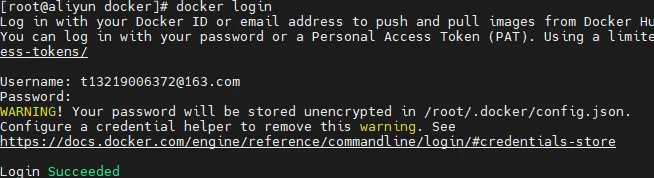
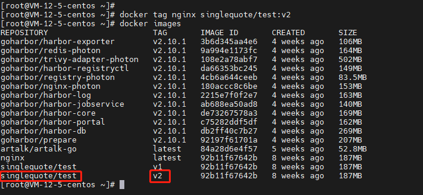
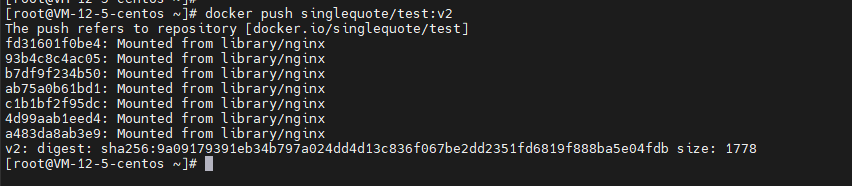
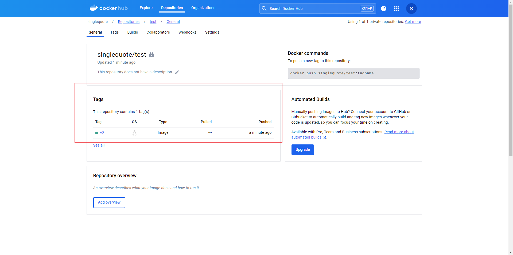
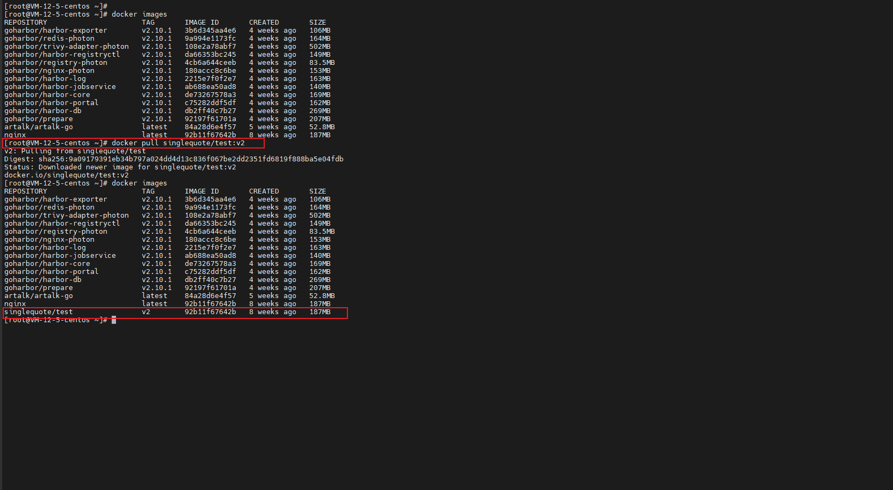
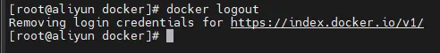

1. 在 [docker hub 官网](https://hub.docker.com/)注册并登录账号。
   

2. 在官网创建自己的容器镜像仓库。
   
   

3. 此时你已经拥有一个容器镜像仓库，接下来在服务器上登录 docker 使用 `docker login` 命令登录 `docker hub`
   

4. 使用`docker tag`命令给需要上传的镜像打 tag。

   ```bash
   docker tag REPOSITORY:TAG NAMESPACE/REPOSITORY:TAG
   ```

   
   **注意事项**：给需要上传的镜像打 tag 的时候需要加上自己的`docker hub`命令空间前缀。

5. 使用 `docker push NAMESPACE/REPOSITORY:TAG` 将上传到你的`docker hub`的仓库中。
   
   此时，你的镜像仓库中已经有你上传的镜像了
   

6. 使用`docker pull NAMESPACE/REPOSITORY:TAG`方式从镜像仓库拉取镜像
   

7. 使用`docker logout`退出登录
   
