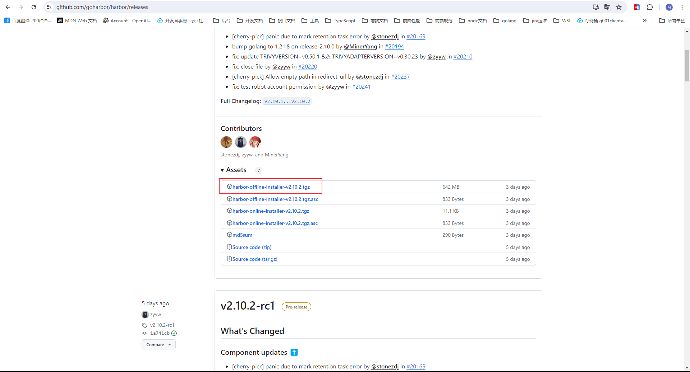
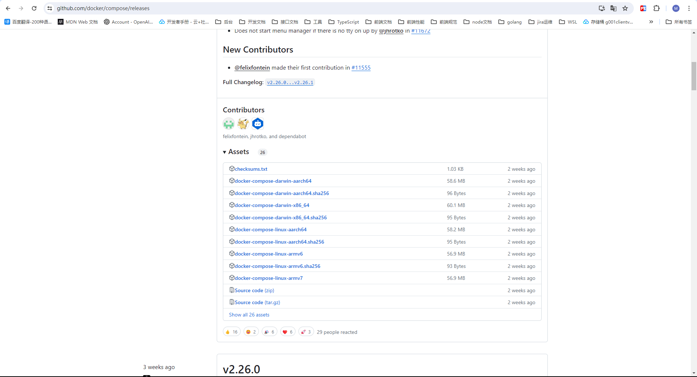
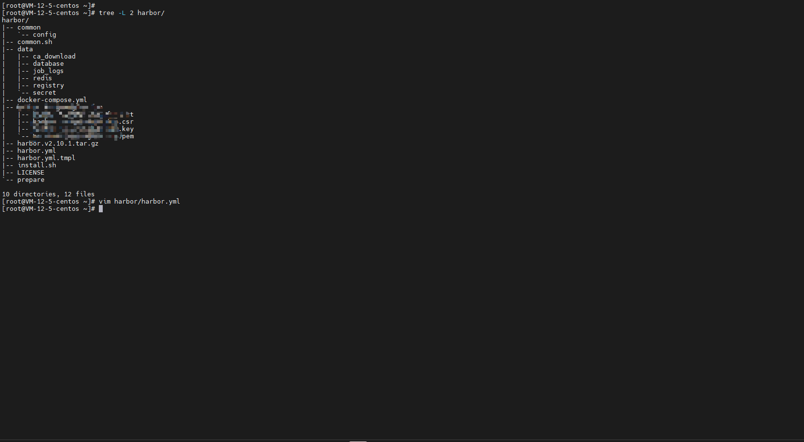
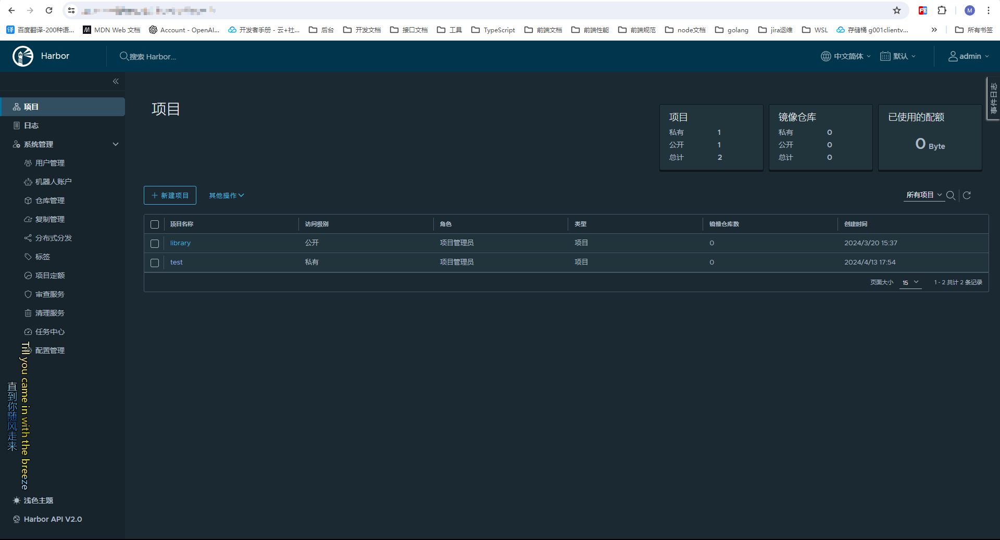
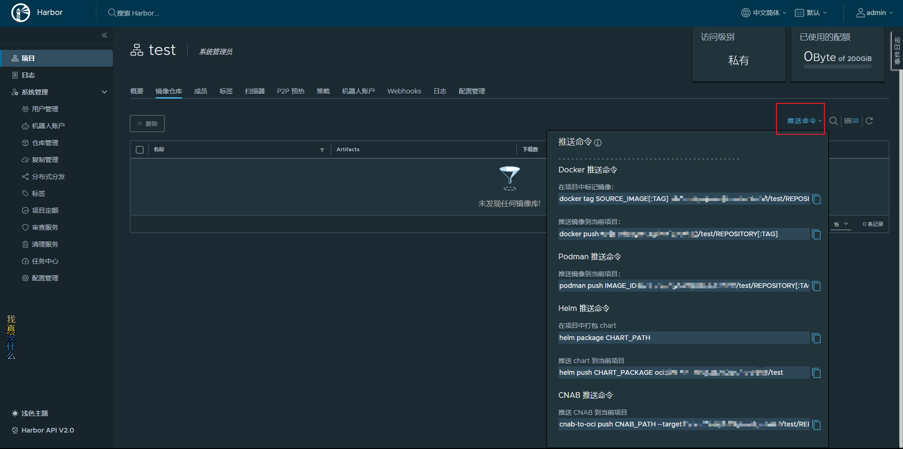

1. 登录 github 下载[habor 离线安装包](https://github.com/goharbor/harbor/releases)，和[docker/compose 组件](https://github.com/docker/compose/releases)。
   
   

2. 将下载的安装包上传到服务器。

3. 使用`mv`命令将`docker/compose`组件重命名为`docker-compose`,并移动到`/usr/bin/`。

4. 使用`tar -xvf harbor离线安装包名` 解压出 harbor。解压出 harbor 安装包如下：
   
   其中打码部分是 harbor 的 ssl 证书配置

5. 复制 `harbor.yml.tmpl` 文件并重命名为 `docker.yml`。

6. 编辑 `harbor.yml`，修改其中内容（建议给仓库配置上 ssl 证书）。

   ```vim
     # harbor服务的仓库
     hostname: reg.mydomain.com

     # http相关内容
     http:
       # 设置http访问端口。默认是80。
       port: http_port

     # https相关
     https:
       # https访问端口。默认443
       port: https_port
       # https证书文件路径
       certificate: /your/certificate/path
       # https证书私钥路径
       private_key: /your/private/key/path

     # harbor管理员密码（账号为admin），默认Harbor12345
     harbor_admin_password: Harbor12345
   ```

7. 运行 `prepare` 文件。

8. 执行安装脚本 `install.sh`。

9. 此时你就已经安装好 harbor 了。可以使用设置的域名或者 ip 加端口访问仓库管理页面。
   

10. 新建一个项目。此时你就可以向项目中推送镜像了。镜像上传下载操作和 `docker hub` 和 `阿里云容器镜像仓库`差不多。具体可以参考文章[docker hub使用](/docker-hub)、[阿里云容器镜像仓库使用](/ali-container-store)。注意在使用 `docker login` 登录时记得加上自己的仓库地址。
  